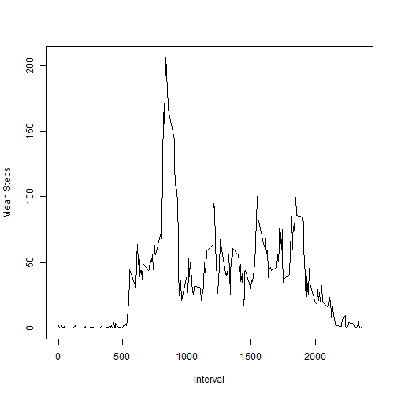

## Reproducible Research Peer Assessment 1  

========================================================

### Introduction
This markdown document is written to satisfy the requirements for [Peer Assessment 1] for [Reproducible Research] (https://github.com/DataScienceSpecialization/courses/tree/master/05_ReproducibleResearch)  

### Loading and Reprocessing Data

```r
activity_raw <- read.csv("activity.csv")
str(activity_raw)
```

```
## 'data.frame':	17568 obs. of  3 variables:
##  $ steps   : int  NA NA NA NA NA NA NA NA NA NA ...
##  $ date    : Factor w/ 61 levels "2012-10-01","2012-10-02",..: 1 1 1 1 1 1 1 1 1 1 ...
##  $ interval: int  0 5 10 15 20 25 30 35 40 45 ...
```

```r
activity <- activity_raw
activity$date <- as.Date(activity$date, format = "%Y-%m-%d")  #date fr factor 2 date
activity$steps <- as.numeric(activity$steps)
str(activity)
```

```
## 'data.frame':	17568 obs. of  3 variables:
##  $ steps   : num  NA NA NA NA NA NA NA NA NA NA ...
##  $ date    : Date, format: "2012-10-01" "2012-10-01" ...
##  $ interval: int  0 5 10 15 20 25 30 35 40 45 ...
```

```r
sum_daily_vector <- aggregate(activity$steps ~ activity$date, FUN = "sum")
mean_interval_vector <- aggregate(activity$steps ~ activity$interval, FUN = "mean")
```

### What is the mean total number of steps per day?

```r
hist(sum_daily_vector[, 2], main = "Histogram of steps per day", xlab = "Steps")
```

 

```r
mean(sum_daily_vector[, 2])
```

```
## [1] 10766
```

```r
median(sum_daily_vector[, 2])
```

```
## [1] 10765
```


### What is the daily activity pattern? (This part done w/o inputting missings as the instructions were unclear)

```r
plot(mean_interval_vector[, 1], mean_interval_vector[, 2], type = "l", xlab = "Interval", 
    ylab = "Mean Steps")
```

 

```r
record <- mean_interval_vector[mean_interval_vector[, 2] == max(mean_interval_vector[, 
    2]), ]
print("Interval at max number of steps:")
```

```
## [1] "Interval at max number of steps:"
```

```r
record[1, 1]
```

```
## [1] 835
```


### Inputating of Missing Values  
1. Calculate number of missing values in data set:

```r
steps.summary <- summary(activity$steps)
steps.summary[7]
```

```
## NA's 
## 2304
```

```r
interval.summary <- summary(activity$interval)
interval.summary[7]
```

```
## <NA> 
##   NA
```


2,3 Replace the missing values with the average for the interval and create new dataset

```r
activity_mvfi <- activity  #copy activity to activity with missing values filled in.
for (i in 1:length(activity_mvfi$date)) {
    if (is.na(activity_mvfi$steps[i])) {
        record <- mean_interval_vector[mean_interval_vector[, 1] == activity_mvfi$interval[i], 
            ]
        activity_mvfi$steps[i] <- record[1, 2]
    }
}
```

4. Calculate the mean and median with the missing values filled in

```r
sum_daily_vector <- aggregate(activity_mvfi$steps ~ activity_mvfi$date, FUN = "sum")
hist(sum_daily_vector[, 2], main = "Histogram of steps per day", xlab = "Steps")
```

 

```r
mean(sum_daily_vector[, 2])
```

```
## [1] 10766
```

```r
median(sum_daily_vector[, 2])
```

```
## [1] 10766
```


### Are there differences in activity patterns between weekdays and weekends?
1. Create new vector of variable indicating whether the day was weekday or weekend

```r
activity_mvfi$day <- weekdays(activity_mvfi$date)
activity_mvfi$weekdayorend = "weekday"
for (i in 1:length(activity_mvfi$date)) {
    if (activity_mvfi$day[i] == "Saturday") {
        activity_mvfi$weekdayorend[i] = "weekend"
    }
    if (activity_mvfi$day[i] == "Sunday") {
        activity_mvfi$weekdayorend[i] = "weekend"
    }
}
```


2. Make panel plot contrasting weekdays and weekends steps taken

```r
activity_mvfi_wd <- activity_mvfi[activity_mvfi$weekdayorend == "weekday", ]
activity_mvfi_we <- activity_mvfi[activity_mvfi$weekdayorend == "weekend", ]
mean_interval_vector_wd <- aggregate(activity_mvfi_wd$steps ~ activity_mvfi_wd$interval, 
    FUN = "mean")
mean_interval_vector_we <- aggregate(activity_mvfi_we$steps ~ activity_mvfi_we$interval, 
    FUN = "mean")
# data_for_lattice<-cbind(mean_interval_vector_wd$interval,mean_interval_vector_wd$steps,
# mean_interval_vector_we$steps)
plot(mean_interval_vector_we[, 1], mean_interval_vector_we[, 2], type = "l", 
    xlab = "Interval", ylab = "Mean Steps", main = "weekend")
```

 

```r
plot(mean_interval_vector_wd[, 1], mean_interval_vector_wd[, 2], type = "l", 
    xlab = "Interval", ylab = "Mean Steps", main = "weekday")
```

 


